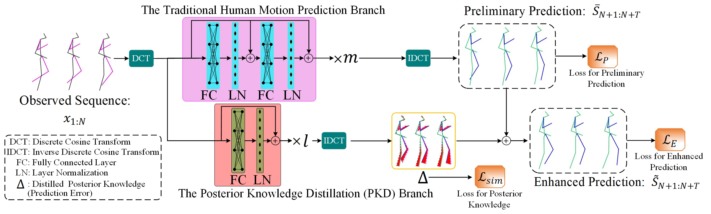

## Distilling Posterior Knowledge for Human Motion Prediction
This is the code for the paper

Jinkai Li, Jinhua Wang, Xiaoling Luo, Xin Wang, Yongting Hu, Yong Xu
[_"Distilling Posterior Knowledge for Human Motion Prediction"_]. In IEEE International Conference on multimedia and expo (ICME), 2025.

### Network Architecture
------


This is the network architecture of our proposed PKD framework for human motion prediction. 


 

### Dependencies

* cuda 11.4
* Python 3.8
* Pytorch 1.7.0

### Get the data

[Human3.6m](http://vision.imar.ro/human3.6m/description.php) in exponential map can be downloaded from [here](http://www.cs.stanford.edu/people/ashesh/h3.6m.zip).

Directory structure: 
```shell script
h3.6m
|-- S1
|-- S5
|-- S6
|-- ...
`-- S11
```
[CMU mocap](http://mocap.cs.cmu.edu/) was obtained from the [repo](https://github.com/chaneyddtt/Convolutional-Sequence-to-Sequence-Model-for-Human-Dynamics) of ConvSeq2Seq paper.
Directory structure:
```shell script
cmu_mocap
|-- test
|-- train
```

[3DPW](https://virtualhumans.mpi-inf.mpg.de/3DPW/) from their official website.

Directory structure: 
```shell script
3dpw
|-- imageFiles
|   |-- courtyard_arguing_00
|   |-- courtyard_backpack_00
|   |-- ...
`-- sequenceFiles
    |-- test
    |-- train
    `-- validation
```
Put the all downloaded datasets in ./datasets directory.

### Training
All the running args are defined in [opt.py](utils/opt.py). We use following commands to train on different datasets and representations.
To train,
```bash
python train_H36M.py  --num 48   --similar_weight 0.1  --distill_layer_num 12
```
```bash
python train_CMU.py  --num 48   --similar_weight 0.1  --distill_layer_num 6
```
```bash
python train_3DPW.py  --num 48   --similar_weight 0.1 --distill_layer_num 6
```
### Evaluation
To evaluate the pretrained model,
```bash
python test_H36M.py
```
```bash
python test_CMU.py
```
```bash
python test_3DPW.py
```

### Citing

If you use our code, please cite our work

```

```

### Acknowledgments

